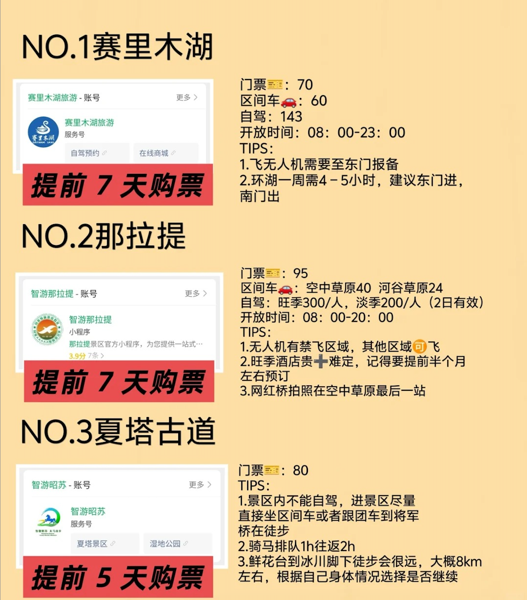
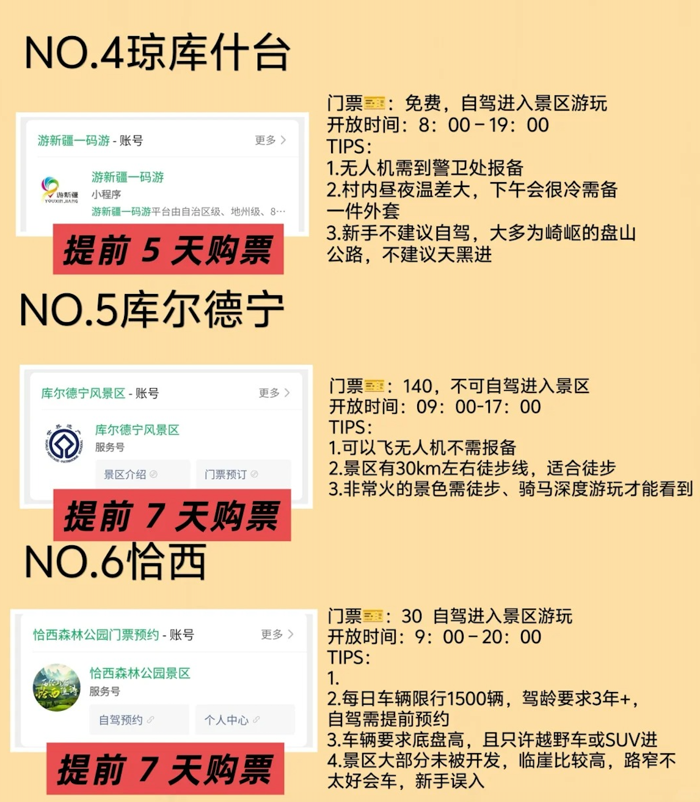
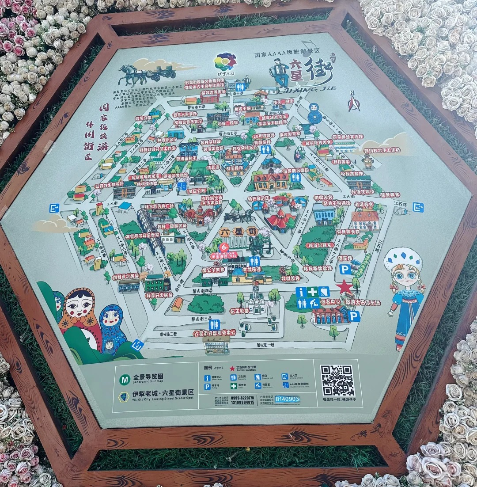
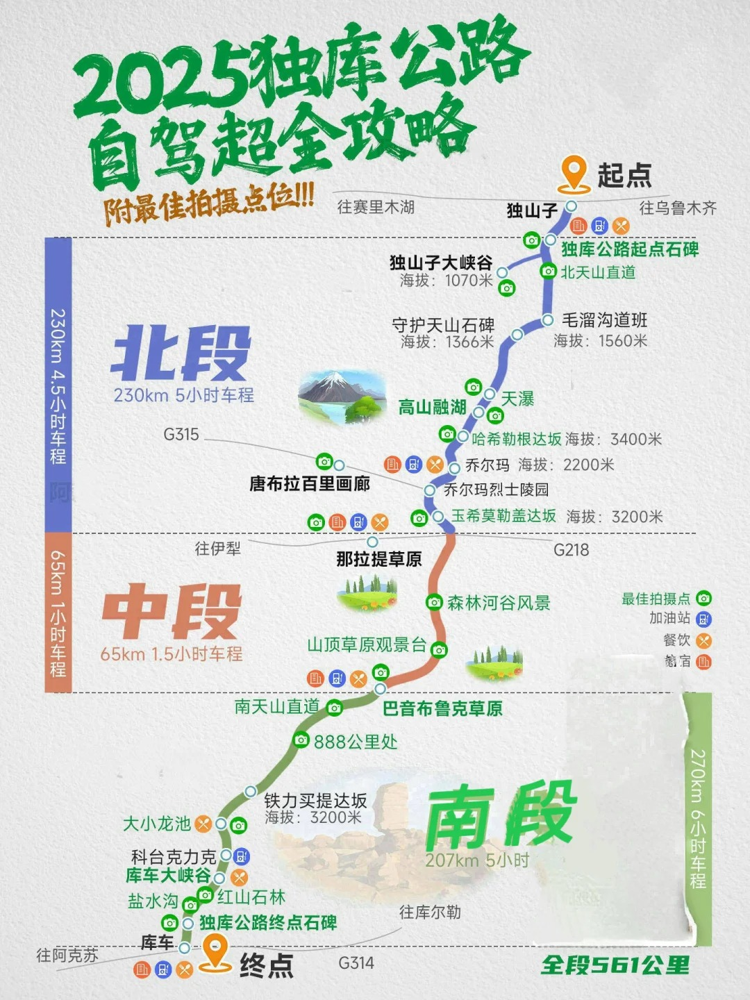

## 
新疆（5.31-6.8）

> 时间：（5.31-6.8） 
> 机票往返： 
> 厦门-乌鲁木齐 08:10～15:40  经停长沙(看看能不能买茶颜悦色)  1h  
> 乌鲁木齐-厦门 07:30 ～ 14:25 经停南京 1h  
> 衣着： 

> 注意：  
>   不要坐黑车 
>   注意防晒 
>   保湿水乳和保湿面膜 
>   带牙线 
>   记得带保温杯 
>   新疆大肉就是猪肉 
>   不要用手摸，听说用手摸代表要买 
>   确定要买再开始还价 
>   未加工的马奶需要注意，不是很干净 

### 景点预约

 

### 总行程
+ day1：出发地﹣乌鲁木齐-住乌鲁木齐（接机）
+ day2：乌鲁木齐﹣独山子大峡谷﹣精河
+ day3：精河﹣自驾赛里木湖(有自行车预赛，可能下午才开放)﹣伊犁果子沟大桥﹣六星街﹣住伊宁
+ day4：伊宁﹣﹣夏塔古道﹣远眺木扎特冰川﹣住昭苏
+ day5：昭苏﹣自驾琼库什台古村落﹣夜观八卦城离街-住特克斯
+ day6：特克斯﹣途径恰甫其海﹣自驾恰西森林公园（恰西环线修路，可能要改成库尔德宁，恰西森林公园应该还是会去）﹣住那拉提
+ day7：那拉提﹣那拉提空中草原-独库公路﹣住唐布拉
+ day8：唐布拉﹣孟克特古道﹣途径百里画廊-独库公路﹣住乌鲁木齐
+ day9：乌鲁木齐﹣出发地
 

### day1
+ 路线：出发地﹣乌鲁木齐-住乌鲁木齐（接机）
+ 住宿：乌鲁木齐 星程酒店(乌鲁木齐新天润机场店)
+ 行程安排：
    + 下午三点半落地，约五点出门去 
    + 国际大巴扎吃晚饭（地铁三工站->二道桥）
    + 新疆民街（西域风格，步行）或者 红山公园（可以俯瞰整个乌鲁木齐，公交61路）
    + 领馆巷吃小吃（夜宵，公交104路）ps：和田二街好吃街好像评论不咋样
+ 吃的：
    + 喀什一把抓
    + 大漠红嘴雁（大巴扎）
    + 伊孜海迩冰淇淋
    + 白尓开提抗烤肉
    + 萨哈拉奶茶馆
    + 胖子金牌拌面
    + 玛尔哈巴·塔塔尔糕点（华侨小区店）
    + 新疆奶制品：奶酪包、奶皮子、酸奶、奶片、酸奶疙瘩
    + 阿尔曼超市（买特产）
 

### day2
+ 路线：乌鲁木齐﹣独山子大峡谷﹣精河
+ 住宿：精河 锦疆酒店
+ 行程安排：
    + 景点：独山子大峡谷
        + 门票：💰30r/人
        + 开放时间：8:30-22:00
        + 游玩时间：2-3h
        + 游玩项目：
            + 独库大玻璃桥：💰80r
                玻璃桥高150米，全长186米，可体验9D特效，是观赏独山子大峡谷独特地貌的最佳位置。
            + 峡谷溜索：💰58r
                有两条滑索，从近百米落差的崖壁飞速降落，往返都可以坐。
            + 地轨滑车：💰70r
                包含上下行。全程850m，有8个极速弯，下行好玩，上行省力避免爬台阶。
            + 峡谷水滑道：💰68r
                玻璃水滑道沿着独山子大峡谷打造，全长1000多米，有一个大S弯和两个360°转盘，乘坐橡皮船，就像峡谷版激流勇进！
            + 临崖咖啡馆：
                进店强制消费，一杯咖啡最多进两人，咖啡均价💰50r。下午人很多，可以坐在悬崖边喝咖啡还是很惬意的！
            + 步步惊心💰58
            + 峡谷魔网💰58r
            + 高空单车💰58r
            + 冰雪大世界💰 58r
    + 安集海大峡谷（免费，未开发）

+ 吃的：
    + 金莲宽粉大盘鸡
 

### day3
+ 路线：精河﹣自驾赛里木湖﹣伊犁果子沟大桥﹣六星街﹣住伊宁
+ 住宿：伊宁六星街民宿 栖宿民宿
+ 行程安排：
    + 赛里木湖
         
        + 门票：
            + 景区门票：70/人
            + 自驾服务费:75/人
            + 区间车票：60/人
            + 自驾套票(24h)：145/人
            + 自驾套票(48h)：190/人
            + 营业时间：8:00-23:00 (非营业时间也可进出)
            + 东门人工售票10:00开始
        + 路线：
            + 月亮湾：坐帆船就1-1.5小时，不坐就30分钟（天气好我建议坐帆船，值这120）
            + 点将台：30分钟
            + 克勒涌珠：30分钟
            + 灯塔：30分钟
            + S弯：20分钟（定位乳海之源附近）
            + 松树头：30分钟，有森林栈道，登山往返需2小时
            + 白花海：20分钟（松树头往南门走几百米）
            + 果子沟大桥观景台-悬石（第四停车场）：往返1小时，很适合拍照，有一个约两米高的石头，在上面拍照像在悬崖边
        + 游玩项目🎯
            + 滑翔伞：十里长堤，580/人
            + 帆船：月亮湾，120/人
            + 卡丁车：月亮湾，50/人
            + 直升飞机：月亮湾，880/人
            + 彩虹滑道：北门附近，30/次
    + 六星街景区：
         
        + 竹马西地客：很有伊犁特色的咖啡馆，进门的走廊非常漂亮
        + 谷朵格瓦奇：店内颜色搭配很清新，有种到新疆人家做客的感觉
        + 疆漫人间：外面墙上是两个漂亮的维吾尔族小帽子
        + 工人街：有各种颜色的窗户，很有伊犁标志感
        + 赛里木街：路两旁都是彩色房子，随手一拍都出片
        + 黎光街：好多文创店，里面是可可爱爱的特色小物件
        + ...
    + 其余游玩景点：喀赞其（商业化没那么严重，六星街可能商业化严重些）
+ 吃的：
    + 蓝墙面肺子
    + 尕巷子粉汤
    + 艾山江小锅抓饭
    + 老字号故乡烤肉店
    + 塔尔院子糕点坊
    + 乌孙奶茶馆
    + 马姑娘的油糕和咖啡店
    + 古兰丹姆手工冰淇淋（还有一家老五中冰淇淋听说更好吃），吃原味
 

### day4
+ 路线：伊宁﹣夏塔古道﹣远眺木扎特冰川﹣住昭苏
+ 住宿：昭苏县民宿 春风十里民宿
+ 行程安排：
    + 夏塔古道
         
        + 门票&预约：80元（提前7天"智游昭苏"抢票！），最佳预约：9:00-10:00（下午常下雨）
        + 路线：
        + 景区大门-温泉酒店。必坐区间车（40分钟），建议赶首班车！不然排队1h+
        + 温泉酒店-将军桥。电瓶车15分钟/徒步1.5小时，体力一般建议坐车，保存体力
        + 将军桥-鲜花台。精华路段！徒步1h/骑马1h，最佳机位：4号卡拉房子附近，可以和木扎尔特冰川合影。
        + 鲜花台-冰川（可选）。仅推荐徒步大神挑战（往返5h）
        + 注意事项：带保温杯、雨鞋、现金（可能没信号）
+ 吃的：
    + 夏塔古道里面吃的比较贵，可以带自热锅
 

### day5
+ 路线：昭苏﹣自驾琼库什台古村落﹣夜观八卦城离街-住特克斯
+ 住宿：特克斯琼库什台（特克斯县）半坡民宿
+ 行程安排：
    + 琼库什台
        + 琼库什台草原。位置在琼库什台村，一望无际的草原，牛羊成群，远处是连绵的雪山，随手一拍就是大片！
            + 拍摄技巧： 用广角镜头，从低角度往上拍，显得草原更辽阔，人物更突出！
            + 最佳时间：早上七点（没有住在琼库什台时间应该来不及）
        + 琼库什台雪山观景台。傍晚6点左右，夕阳洒在雪山上，画面超温柔！
        + 凌晨看银河：没有住在琼库什台看不到
    + 八卦城：可以航拍，需提前向警方报备无人机。
        + 最佳机位：城中心太极坛（俯拍八卦阵）、摩天轮高空视角（夜景灯光璀璨）。
        + 离街民俗风情街。彩色壁画墙、民族手工艺品店、特色民宿聚集地，拍照出片率超高。打卡“我在特克斯很想你”路牌，品尝哈萨克族奶茶、手工冰淇淋。   
        + 八卦城之夜摩天轮。亚洲最大太极主题摩天轮，升至高空俯瞰全城灯光八卦阵。旺季排队人多，建议傍晚前往，同时捕捉日落和夜景。  
        + 周易文化体验。太极坛博物馆，了解八卦城建造历史和易经文化。
+ 吃的：
    + 哈萨克族手抓饭、烤羊肉、奶茶
    + 赞一口。奶皮子冰淇淋15R/杯，特色小吃。
    + 米罗凯奇。奶酪包 18R/盒，里面有三块
    + 阿不拉馕。4元/个，有牛奶馕、玫瑰馕、辣皮子馕
    + 美食街原始抓饭。羊排抓饭 30R、碎肉抓饭 20R、烤羊肉 4R/串、烤香肠 2R/串。
    + 美食街秘制椒麻鸡。椒麻鸡 58/小份、2串羊肉串4R/串、2串牛肉串3R/串。
    + 美食街食里路炒羊杂烧烤大盘鸡。大盘鸡 88R/小份 128R/大份，卡瓦斯 20R/小袋 1.5L，大盘鸡两个人建议点小份，还赠一份皮带面。要和老板说上面他才上，将面拌在大盘鸡里浸汤。来这边一定要尝一下卡瓦斯，和哈尔滨的格瓦斯不一样
    + 离街买买提艾力烤肉店。羊肉串4元/串，牛肉串3元/串。进店里找老板要盘子，去冰柜自己拿串串，要馕的话直接和老板说，外面没地方的话里面还有一个屋子，串串肉很多，两个人吃了不到40R
    + 库尔班浓香馕坑烤肉。人不是很多但老板上菜有点慢，这家不是自己拿串，馕没有很香，但是10R/串的馕坑肉好吃
    + 欧嘉烤肉
 

### day6
+ 路线：特克斯﹣途径恰甫其海﹣自驾恰西森林公园（恰西环线修路，可能要改成库尔德宁，恰西森林公园应该还是会去）﹣住那拉提
+ 住宿：那拉提 汀澜酒店
+ 行程安排：
    + 恰甫其海拍照打卡点：
        + 观景台俯瞰全景
        + 铁栅栏旁的斜坡：湖水与山峦的完美融合。
        + 人工沙滩海边度假感
        + 湖边细节与无人机航拍：往前走4、5公里，左手边有个沥青路大停车场，这里可以拍到湖边的细节
        + 小白花与拐弯路：再往前走，有一个大拐弯的路边停车点。这里可以拍到小白花和湖水的合照，对面还能拍到这条路的拐弯
    + 恰西：适合航拍
        + 门票：30
        + 开放时间：9:00-20:00
    + 库尔德宁：适合航拍.无人机不需要报备。适合徒步
        + 门票：140
        + 开放时间：9:00-17:00
+ 吃的：
    + 塔西纳餐厅
    + 阿娜尔家
        + 包尔萨克：很有特点的菜品，配上各种果酱
        + 胡尔达克：盛放在蝴蝶造型的盘子里，菜品口感丰富，拌饭很香
        + 肚包肉：羊肚包牛肉，软烂且入味
        + 新疆玫瑰咸奶茶：奶味十足，混合着玫瑰花香
 

### day7
+ 路线：那拉提﹣那拉提空中草原-独库公路﹣住唐布拉
+ 住宿：唐布拉 古道山前民宿
+ 行程安排：
    + 那拉提
         
        + 门票：95 空中草原 40  河谷草原 24
        + 开放时间：08:00-20:00
        + 路线：
            + 空中草原。
                + 进入景区后直奔空中草原区间车（40元），直达终点站游牧人家（40分钟），途中不停靠，避开旅游团的中途下车点
                + 雪莲谷深度游。在游牧人家换乘雪莲谷专线区间车（需另购60元，20分钟），14:00前抵达雪莲谷（旅游团多集中在上午来此）
                + 游牧人家隐藏机位。返回游牧人家后，向西北方向步行15分钟（非游客栈道），找到牧民放牧的野花坡，用长焦拍摄。网红小溪流：下午阳光强烈时人群较多，建议避开主河道，向上游步行100米，人就很少了
                + 天云台快速出片。乘空中草原区间车返程至天云台，俯拍草原全景，此时旅游团多已前往河谷草原，人流量减少50%
	        + 河谷草原转场
                + 从景区门口换乘 河谷草原区间车（24元），跳过前3站，直接坐到终点站森林公园（30分钟）
                + 森林公园→乌孙古迹（反向游览）。反向路线：从森林公园向回走，依次拍摄：
                    + 天鹰台徒步（非游客常规路线）：向山顶走20分钟，拍“爱心树”剪影（比空中草原线人少）
                    + 乌孙古迹：旅游团已撤离，独享场景
                    + 塔吾萨尼：傍晚柔和光线下的毡房炊烟，长焦抓拍牧民归家场景
                + 乘坐河谷草原区间车，返回景区门口。
    + 独库公路
         
    + 唐布拉晚上看星星，听狼叫（概率）
+ 吃的：
    + 住山里可能没什么美食
 

### day8
+ 路线：唐布拉﹣孟克特古道﹣途径百里画廊-独库公路﹣住乌鲁木齐
+ 住宿：乌鲁木齐 星程酒店(乌鲁木齐新天润机场店) 不带早餐
+ 行程安排：
    + 孟克特古道
         
        + 景区站点: 游客中心 - 峡谷长巷 - 壮丽之门 - 高原草甸 - 石林激流 - 雪山温泉区 - 小天湖
            + 起点: 独库公路625公里处
            + 终点:“百里画廊”之称的尼勒克县唐布拉
            + 峡谷长卷：溪水潺潺，野花盛开，交织成一幅动人的自然画卷
            + 高原草甸：广阔的草甸，可见阿萨克族牧民和养蜂人家，还有土拨鼠
            + 石林激流：雪山融水形成的壮观瀑布和溪流
            + 雪山温泉区：在雪山脚下的天然温泉，可俯瞰美景
            + 小天湖：美丽的高山淡水湖泊，比天山天池的海拔还高600米
        + 注意：
            + 景区只有一个进出口
            + 路面几乎都是石子和土路，底盘低的车会比较难开，建议驾驶SUV或越野车
            + 厕所只有售票处有比较好的公厕，其他只有石林激流和温泉区有简易的厕所
            + 不建议坐景区区间车，容易吃灰，等待时间较长（半小时一班）
    + 百里画廊
         
        + 小华山观景台：门票15元/人，导航“小华山”。要上观景台需要爬2700级左右的台阶，爬升海拔300米左(2000->2300)，到顶以后人少景美，视野超级开阔，高山草甸、树林、雪山这里都有。
        + 百里画廊观景台：爬上观景台可以看到空中草原，适合拍日落，有露营停车场。
        + __仙女湖__(这个建议去，刷到好几次了)：导航“仙女湖马队”或者“仙女湖停车场”。藏在山脉里的绝美安静小湖，和蓝天白云，绿色青山，鲜花小草衬托得像世外桃源，需要交10元／人的门票（网络不好记得带上现金），仙女湖不是开发完善的景区，山上无厕所。骑马往返1.5小时左右，徒步往返3-4小时，体力不好的建议骑马往返，费用¥200/人
+ 吃的：
    + 乌鲁木齐同 day1
 

### day9
+ 路线：乌鲁木齐﹣出发地  

        
